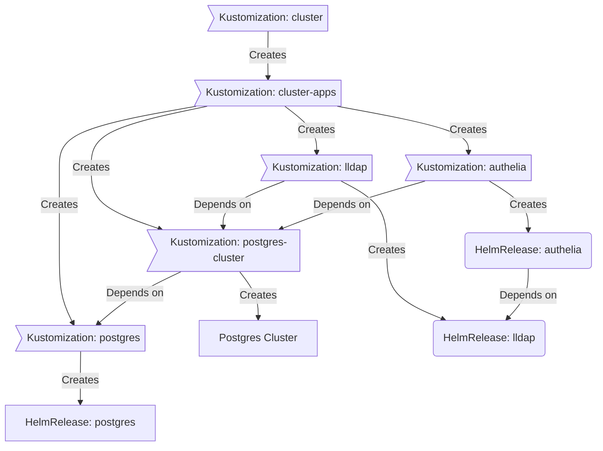

<div align="center">


### My Home Operations Repository :octocat:

_... managed with Flux, Renovate, and GitHub Actions_ 🤖

</div>


<div align="center">

[](https://discord.gg/home-operations)&nbsp;&nbsp;
[](https://talos.dev)&nbsp;&nbsp;
[](https://kubernetes.io)&nbsp;&nbsp;
[](https://github.com/coolguy1771/home-ops/actions/workflows/renovate.yaml)

</div>

<div align="center">

[](https://github.com/kashalls/kromgo)&nbsp;&nbsp;
[](https://github.com/kashalls/kromgo)&nbsp;&nbsp;
[](https://github.com/kashalls/kromgo)&nbsp;&nbsp;
[](https://github.com/kashalls/kromgo)&nbsp;&nbsp;
[](https://github.com/kashalls/kromgo)&nbsp;&nbsp;
[](https://github.com/kashalls/kromgo)&nbsp;&nbsp;
[](https://github.com/kashalls/kromgo)

</div>

---

## 📖 Overview

This is a mono repository for my home infrastructure and Kubernetes cluster. I try to adhere to Infrastructure as Code (IaC) and GitOps practices using the tools like [Ansible](https://www.ansible.com/), [Pulumi](https://pulumi.com), [Kubernetes](https://kubernetes.io/), [Flux](https://github.com/fluxcd/flux2), [Renovate](https://github.com/renovatebot/renovate) and [GitHub Actions](https://github.com/features/actions).

---

## ⛵ Kubernetes

There is a template over at [onedr0p/flux-cluster-template](https://github.com/onedr0p/flux-cluster-template) if you wanted to try and follow along with some of the practices I use here.

### Installation

My cluster is [talos](https://talos.dev) provisioned overtop bare-metal. This is a semi hyper-converged cluster, workloads and block storage are sharing the same available resources on my nodes while I have a separate server for (NFS) file storage.


### Core Components

- [actions-runner-controller](https://github.com/actions/actions-runner-controller): self-hosted Github runners
- [cilium](https://github.com/cilium/cilium): internal Kubernetes networking plugin
- [cert-manager](https://cert-manager.io/docs/): creates SSL certificates for services in my cluster
- [external-dns](https://github.com/kubernetes-sigs/external-dns): automatically syncs DNS records from my cluster ingresses to a DNS provider
- [external-secrets](https://github.com/external-secrets/external-secrets/): managed Kubernetes secrets using [1Password Connect](https://github.com/1Password/connect).
- [ingress-nginx](https://github.com/kubernetes/ingress-nginx/): ingress controller for Kubernetes using NGINX as a reverse proxy and load balancer
- [rook](https://github.com/rook/rook): distributed block storage for persistent storage
- [sops](https://toolkit.fluxcd.io/guides/mozilla-sops/): managed secrets for Kubernetes, Ansible, and Terraform which are committed to Git
- [spegel](https://github.com/XenitAB/spegel): stateless cluster local OCI registry mirror
- [tf-controller](https://github.com/weaveworks/tf-controller): additional Flux component used to run Terraform from within a Kubernetes cluster.
- [volsync](https://github.com/backube/volsync): backup and recovery of persistent volume claims

### GitOps

[Flux](https://github.com/fluxcd/flux2) watches the clusters in my [kubernetes](./kubernetes/) folder (see Directories below) and makes the changes to my clusters based on the state of my Git repository.

The way Flux works for me here is it will recursively search the `kubernetes/${cluster}/apps` folder until it finds the most top level `kustomization.yaml` per directory and then apply all the resources listed in it. That aforementioned `kustomization.yaml` will generally only have a namespace resource and one or many Flux kustomizations (`ks.yaml`). Under the control of those Flux kustomizations there will be a `HelmRelease` or other resources related to the application which will be applied.

[Renovate](https://github.com/renovatebot/renovate) watches my **entire** repository looking for dependency updates, when they are found a PR is automatically created. When some PRs are merged Flux applies the changes to my cluster.

### Directories

This Git repository contains the following directories under [Kubernetes](./kubernetes/).

```sh
📁 kubernetes
├── 📁 kyak            # kyak cluster
│   ├── 📁 apps           # applications
│   ├── 📁 bootstrap      # bootstrap procedures
│   ├── 📁 flux           # core flux configuration
│   └── 📁 templates      # re-useable components
└── 📁 sol         # sol cluster
    ├── 📁 apps           # applications
    ├── 📁 bootstrap      # bootstrap procedures
    └── 📁 flux           # core flux configuration
```

### Flux Workflow

This is a high-level look how Flux deploys my applications with dependencies. Below there are 3 apps `postgres`, `lldap` and `authelia`. `postgres` is the first app that needs to be running and healthy before `lldap` and `authelia`. Once `postgres` is healthy `lldap` will be deployed and after that is healthy `authelia` will be deployed.



### Networking

| Name                                          | CIDR              |
|-----------------------------------------------|-------------------|
| Management VLAN                               | `10.1.237.0/24`  |
| Kubernetes Nodes VLAN                         | `10.10.10.0/24` |
| Kubernetes external services (Cilium w/ BGP)  | `10.0.42.0/24` |
| Kubernetes pods                               | `10.42.0.0/16`    |
| Kubernetes services                           | `10.43.0.0/16`    |

- HAProxy configured on my `Vyos` router for the Kubernetes Control Plane Load Balancer.
- Cilium configured with `loadBalancerIPs` to expose Kubernetes services with their own IP over BGP (w/ECMP) which is configured on my router.

---

## ☁️ Cloud Dependencies

While most of my infrastructure and workloads are selfhosted I do rely upon the cloud for certain key parts of my setup. This saves me from having to worry about two things. (1) Dealing with chicken/egg scenarios and (2) services I critically need whether my cluster is online or not.

The alternative solution to these two problems would be to host a Kubernetes cluster in the cloud and deploy applications like [HCVault](https://www.vaultproject.io/), [Vaultwarden](https://github.com/dani-garcia/vaultwarden), [ntfy](https://ntfy.sh/), and [Gatus](https://gatus.io/). However, maintaining another cluster and monitoring another group of workloads is a lot more time and effort than I am willing to put in.

| Service                                      | Use                                                               | Cost           |
|----------------------------------------------|-------------------------------------------------------------------|----------------|
| [Fastmail](https://fastmail.com/)            | Email hosting                                                     | ~$90/yr        |
| [GitHub](https://github.com/)                | Hosting this repository and continuous integration/deployments    | Free           |
| [Cloudflare](https://www.cloudflare.com/)    | Domain, DNS and proxy management                                  | ~$30/yr        |
| [1Password](https://1password.com/)          | Secrets with [External Secrets](https://external-secrets.io/)     | ~$65/yr        |
| [B2 Storage](https://www.backblaze.com/b2)   | Offsite application backups                                       | ~$5/mo         |
| [Pushover](https://pushover.net/)            | Kubernetes Alerts and application notifications                   | Free           |
| [NextDNS](https://nextdns.io/)               | My routers DNS server which includes AdBlocking                   | ~20/yr         |
| [Frugal](https://frugalusenet.com/)          | Usenet access                                                     | ~$35/yr        |
|                                              |                                                                   | Total: ~$20/mo |

---

## 🌐 DNS

### Home DNS

On my Vyos router I have [Bind9](https://github.com/isc-projects/bind9) and [dnsdist](https://dnsdist.org/) deployed as containers. In my cluster `external-dns` is deployed with the `RFC2136` provider which syncs DNS records to `bind9`.

Downstream DNS servers configured in `dnsdist` such as `bind9` (above) and [NextDNS](https://nextdns.io/). All my clients use `dnsdist` as the upstream DNS server, this allows for more granularity with configuring DNS across my networks. These could be things like giving each of my VLANs a specific `nextdns` profile, or having all requests for my domain forward to `bind9` on certain networks, or only using `1.1.1.1` instead of `nextdns` on certain networks where adblocking isn't required.

### Public DNS

Outside the `external-dns` instance mentioned above another instance is deployed in my cluster and configured to sync DNS records to [Cloudflare](https://www.cloudflare.com/). The only ingress this `external-dns` instance looks at to gather DNS records to put in `Cloudflare` are ones that have an ingress class name of `external` and contain an ingress annotation `external-dns.alpha.kubernetes.io/target`.

---

## 🔧 Hardware

| Device                     | Count | OS Disk Size | Data Disk Size          | Ram   | Operating System | Purpose                |
|----------------------------|-------|--------------|-------------------------|-------|------------------|------------------------|
| Supermicro SYS-510T-ML     | 1     | 256GB NVMe   | N/A                     | 16GB  | Vyos             | Router                 |
| Dell Optiplex 3060 Micro   | 1     | 240GB SSD    | N/A                     | 32GB  | Talos            | Kubernetes master      |
| Dell Optiplex 3080 Micro   | 2     | 256GB SSD    | N/A                     | 16GB  | Talos            | Kubernetes master      |
| Lenovo M910q Tiny          | 2     | 512GB NVMe   | 500GB SSD (rook-ceph)   | 16GB  | Talos            | Kubernetes worker      |
| Lenovo M720q Tiny          | 2     | 480GB NVMe   | N/A                     | 16GB  | Talos            | Kubernetes worker      |
| HP EliteDesk 800 G4 SFF    | 2     | 240GB NVMe   | 500GB SSD (rook-ceph)   | 16GB  | Talos            | Kubernetes worker      |
| HPE DL160 G10              | 1     | 512GB SSD    | 2x6TB HDD (rook-ceph)   | 32GB  | Talos            | Kubernetes worker      |
| HPE DL160 G10              | 1     | 500GB SSD    | 16TB zfs mirror         | 128GB | Ubuntu 23.10     | Shared file storage    |
| Dell R630                  | 1     | 500GB SSD    | 3x1.5TB HDD (rook-ceph) | 192GB | Fedora 39        | Single node k3s cluter |
| TESmart 8 Port KVM Switch  | 1     | -            | -                       | -     | -                | Network KVM (PiKVM)    |
| PiKVM v4 plus              | 1     | -            | -                       | -     | PiKVM (Arch)     | Network KVM            |
| Tripplite SMART3000RMXLN   | 1     | -            | -                       | -     | -                | UPS                    |
| Aruba Instant on 1930 24G  | 1     | -            | -                       | -     | -                | Switch                 |
| Cisco Nexus 9372PX         | 1     | -            | -                       | -     | -                | Switch                 |
| DELL EMC PowerSwitch N2048 | 1     | -            | -                       | -     | -                | Switch                 |

---

## ⭐ Stargazers

<div align="center">

[](https://star-history.com/#coolguy1771/home-ops&Date)

</div>

---

## 🤝 Gratitude and Thanks

Thanks to all the people who donate their time to the [Home Operations](https://discord.gg/home-operations) Discord community. Be sure to check out [kubesearch.dev](https://kubesearch.dev/) for ideas on how to deploy applications or get ideas on what you may deploy.

---

## 📜 Changelog

See my _awful_ [commit history](https://github.com/coolguy1771/home-ops/commits/main)

---

## 🔏 License

See [LICENSE](./LICENSE)
