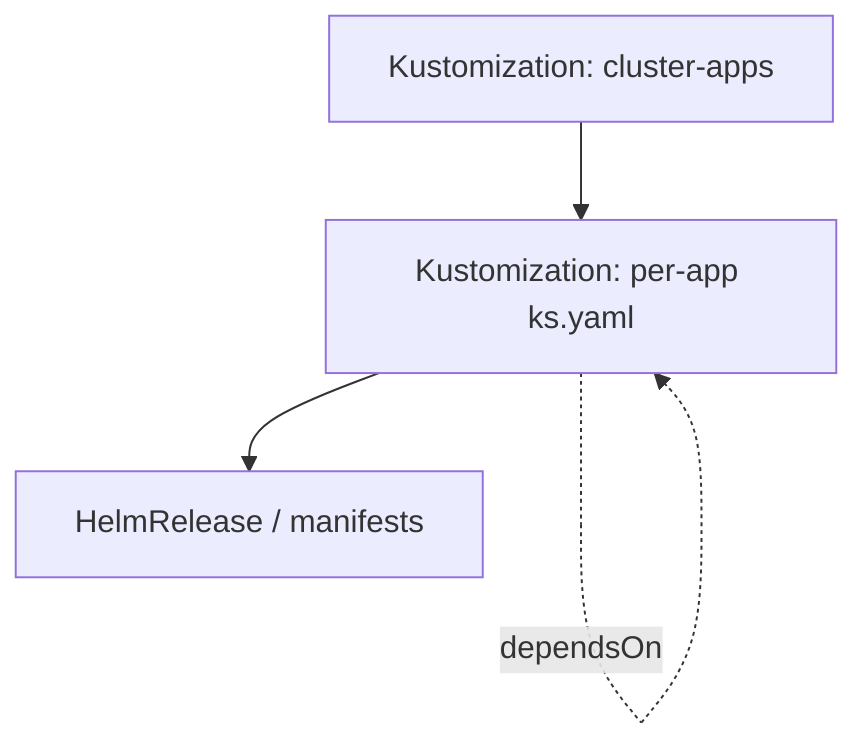

<div align="center">


### My Home Operations Repository

Managed with Flux, Renovate, Pulumi, and GitHub Actions.

</div>

<div align="center">

[](https://discord.gg/home-operations)&nbsp;&nbsp;
[](https://talos.dev)&nbsp;&nbsp;
[](https://kubernetes.io)&nbsp;&nbsp;
[](https://github.com/coolguy1771/home-ops/actions/workflows/renovate.yaml)

</div>

<div align="center">

[](https://github.com/kashalls/kromgo)&nbsp;&nbsp;
[](https://github.com/kashalls/kromgo)&nbsp;&nbsp;
[](https://github.com/kashalls/kromgo)&nbsp;&nbsp;
[](https://github.com/kashalls/kromgo)&nbsp;&nbsp;
[](https://github.com/kashalls/kromgo)&nbsp;&nbsp;
[](https://github.com/kashalls/kromgo)&nbsp;&nbsp;
[](https://github.com/kashalls/kromgo)

</div>

---

## Overview

Mono repository for home infrastructure: a Talos Kubernetes cluster (`kyak`), cloud and network IaC, and supporting automation.

| Area | Tools |
|------|--------|
| Cluster OS | [Talos Linux](https://talos.dev) v1.13.2 |
| Orchestration | [Kubernetes](https://kubernetes.io/) v1.36.1 |
| GitOps | [Flux](https://github.com/fluxcd/flux2), [Renovate](https://github.com/renovatebot/renovate) |
| IaC | [Pulumi](https://www.pulumi.com/) (AWS, GCP, Cloudflare, UniFi) |
| Secrets | [SOPS](https://github.com/getsops/sops) + [External Secrets](https://external-secrets.io/) (1Password) |
| CI | [GitHub Actions](https://github.com/features/actions) |

Forked from [onedr0p/home-ops](https://github.com/onedr0p/home-ops). The [flux-cluster-template](https://github.com/onedr0p/flux-cluster-template) is a good starting point if you want to follow a similar layout.

---

## Repository layout

```text
home-ops/
├── bootstrap/          # Cluster bootstrap (Helmfile, Talos apply)
├── firewall/           # VyOS / network policy artifacts
├── kubernetes/
│   ├── apps/           # Shared Flux app definitions (HelmRelease, ks.yaml, …)
│   ├── components/     # Reusable Kustomize components
│   ├── flux/           # Top-level Flux Kustomization (cluster-apps)
│   └── kyak/           # Cluster-specific overrides and extra apps
├── pulumi/             # Cloud and UniFi IaC (see pulumi/README.md)
├── talos/              # Talos machine config (talhelper) and bootstrap bits
├── docs/               # Operational docs (e.g. backups.adoc)
├── kubeconfig          # Local kubeconfig (gitignored in practice)
└── .taskfiles/         # Task automation (Talos, Volsync, Kubernetes, …)
```

---

## Kubernetes

### Cluster

- **Name:** `kyak`
- **Provisioning:** [Talos](https://talos.dev) on bare metal; semi-hyperconverged (workloads and block storage on nodes, NFS for shared files)
- **Config:** `talos/talconfig.yaml` (generated JSON schema in `talos/talconfig.json`)

### GitOps

Flux watches this repository. The root app bundle is defined in [`kubernetes/flux/cluster/ks.yaml`](kubernetes/flux/cluster/ks.yaml) and applies everything under [`kubernetes/apps`](kubernetes/apps).

Each app directory typically contains:

- `ks.yaml` — Flux `Kustomization` (path, dependsOn, health checks)
- `app/helmrelease.yaml` — Helm deployment (most apps)
- `app/externalsecret.yaml` — secrets from 1Password when needed

Cluster-only resources live under [`kubernetes/kyak`](kubernetes/kyak) when they should not be shared.

[Renovate](https://github.com/renovatebot/renovate) opens PRs for dependency bumps across the repo; merged changes are reconciled by Flux.

### Core platform components

| Component | Role |
|-----------|------|
| [Cilium](https://github.com/cilium/cilium) | CNI, BGP LB IPs, network policies |
| [Envoy Gateway](https://gateway.envoyproxy.io/) | Ingress / Gateway API |
| [cert-manager](https://cert-manager.io/) | TLS certificates |
| [external-secrets](https://external-secrets.io/) | Kubernetes secrets from 1Password |
| [cloudflare-dns](https://github.com/kubernetes-sigs/external-dns) / [unifi-dns](https://github.com/kubernetes-sigs/external-dns) | DNS sync (Cloudflare public, RFC2136 / UniFi home) |
| [rook-ceph](https://github.com/rook/rook) | Distributed block storage |
| [OpenEBS](https://openebs.io/) | Additional storage classes |
| [CloudNative-PG](https://cloudnative-pg.io/) | PostgreSQL operator |
| [volsync](https://github.com/backube/volsync) | PVC backup / replication |
| [spegel](https://github.com/XenitAB/spegel) | Cluster-local OCI mirror |
| [actions-runner-controller](https://github.com/actions/actions-runner-controller) | Self-hosted GitHub runners |
| [sops](https://github.com/getsops/sops) | Encrypted secrets in Git |

Application stacks include media (*arr, Jellyfin, …), monitoring (Grafana, Mimir, Loki, …), FoundryVTT, Discord bots, and more under [`kubernetes/apps`](kubernetes/apps).

### Flux dependency flow

High-level ordering: cluster apps reconcile child `Kustomization` resources; `dependsOn` and health checks serialize apps that need databases or other prerequisites (same pattern as the upstream template).


```mermaid
graph TD;
  cluster[Kustomization: cluster-apps] --> apps[Kustomization: per-app ks.yaml];
  apps --> hr[HelmRelease / manifests];
  apps -.->|dependsOn| apps;
```

### Networking

| Name | CIDR |
|------|------|
| Management VLAN | `10.1.237.0/24` |
| Kubernetes nodes VLAN | `10.10.10.0/24` |
| Kubernetes external services (Cilium BGP) | `10.0.42.0/24` |
| Kubernetes pods | `10.42.0.0/16` |
| Kubernetes services | `10.43.0.0/16` |

- Talos Layer 2 VIP on `10.10.10.201` for the Kubernetes API server
- Cilium `loadBalancerIPs` advertised over BGP (ECMP on the router)

---

## Local development

Load environment variables (kubeconfig, Talos config, SOPS, tooling paths):

```bash
direnv allow   # uses .envrc
# or: mise trust && mise install
```

| File / tool | Purpose |
|-------------|---------|
| `kubeconfig` | Cluster API access |
| `talos/clusterconfig/talosconfig` | `talosctl` |
| `age.key` / `SOPS_AGE_KEY_FILE` | Decrypt SOPS secrets |
| `just` | Bootstrap, Talos, Kubernetes helpers (`just -l`) |
| `task` | Volsync and other workflows under `.taskfiles/` |

Bootstrap a new cluster (see [`bootstrap/mod.just`](bootstrap/mod.just)):

```bash
just bootstrap
```

Kubernetes helpers (restore PVCs, suspend Volsync, etc.): `just -l kube`.

---

## Pulumi and cloud

Infrastructure outside the cluster is under [`pulumi/`](pulumi/) — AWS (CDN, OIDC, SES), GCP org setup, Cloudflare DNS/firewall, and UniFi home network. See [`pulumi/README.md`](pulumi/README.md) for project layout and commands.

---

## Cloud dependencies

Most workloads are self-hosted; a few managed services avoid chicken-and-egg problems and keep critical paths up when the cluster is down.

| Service | Use | Cost |
|---------|-----|------|
| [Fastmail](https://fastmail.com/) | Email hosting | ~$90/yr |
| [GitHub](https://github.com/) | This repo, CI, runners | Free |
| [Cloudflare](https://www.cloudflare.com/) | DNS, proxy, security | ~$30/yr |
| [1Password](https://1password.com/) | Secrets via External Secrets | ~$65/yr |
| [B2 Storage](https://www.backblaze.com/b2) | Offsite backups | ~$5/mo |
| [Pushover](https://pushover.net/) | Alerts and notifications | Free |
| [NextDNS](https://nextdns.io/) | DNS filtering on the router | ~$20/yr |
| [Frugal](https://frugalusenet.com/) | Usenet | ~$35/yr |
| | **Total** | **~$20/mo** |

---

## DNS

### Home DNS

VyOS runs [Bind9](https://github.com/isc-projects/bind9) and [dnsdist](https://dnsdist.org/). In-cluster `unifi-dns` (external-dns, RFC2136) syncs records to Bind9.

Downstream resolvers include Bind9 and NextDNS. Clients use dnsdist so VLANs can get different NextDNS profiles, split-horizon for the home domain, or upstream-only paths where ad blocking is not needed.

### Public DNS

`cloudflare-dns` syncs ingresses with class `external` and annotation `external-dns.alpha.kubernetes.io/target` to [Cloudflare](https://www.cloudflare.com/).

---

## Backups

VolSync-based disaster recovery is documented in [`docs/backups.adoc`](docs/backups.adoc).

---

## Hardware

| Device | Count | OS disk | Data disk | RAM | OS | Role |
|--------|-------|---------|-----------|-----|-----|------|
| Supermicro SYS-510T-ML | 1 | 256GB NVMe | — | 16GB | VyOS | Router |
| Dell Optiplex 3060 Micro | 1 | 240GB SSD | — | 32GB | Talos | Control plane |
| Dell Optiplex 3080 Micro | 2 | 256GB SSD | — | 16GB | Talos | Control plane |
| Lenovo M910q Tiny | 2 | 512GB NVMe | 500GB SSD (rook-ceph) | 16GB | Talos | Worker |
| Lenovo M720q Tiny | 2 | 480GB NVMe | — | 16GB | Talos | Worker |
| HP EliteDesk 800 G4 SFF | 2 | 240GB NVMe | 500GB SSD (rook-ceph) | 16GB | Talos | Worker |
| HPE DL160 G10 | 1 | 512GB SSD | 2×6TB HDD (rook-ceph) | 32GB | Talos | Worker |
| HPE DL160 G10 | 1 | 500GB SSD | 16TB ZFS mirror | 128GB | Ubuntu 23.10 | NFS file storage |
| Dell R630 | 1 | 500GB SSD | 3×1.5TB HDD (rook-ceph) | 192GB | Fedora 39 | Single-node k3s cluster |
| TESmart 8-port KVM | 1 | — | — | — | — | Network KVM (PiKVM) |
| PiKVM v4 plus | 1 | — | — | — | PiKVM (Arch) | Network KVM |
| Tripplite SMART3000RMXLN | 1 | — | — | — | — | UPS |
| Aruba Instant On 1930 24G | 1 | — | — | — | — | Switch |
| Cisco Nexus 9372PX | 1 | — | — | — | — | Switch |
| DELL EMC PowerSwitch N2048 | 1 | — | — | — | — | Switch |

---

## Stargazers

<div align="center">

[](https://star-history.com/#coolguy1771/home-ops&Date)

</div>

---

## Thanks

Thanks to the [Home Operations](https://discord.gg/home-operations) community. For deployment ideas, see [kubesearch.dev](https://kubesearch.dev/).

---

## Changelog

See the [commit history](https://github.com/coolguy1771/home-ops/commits/main).

---

## License

See [LICENSE](./LICENSE).
